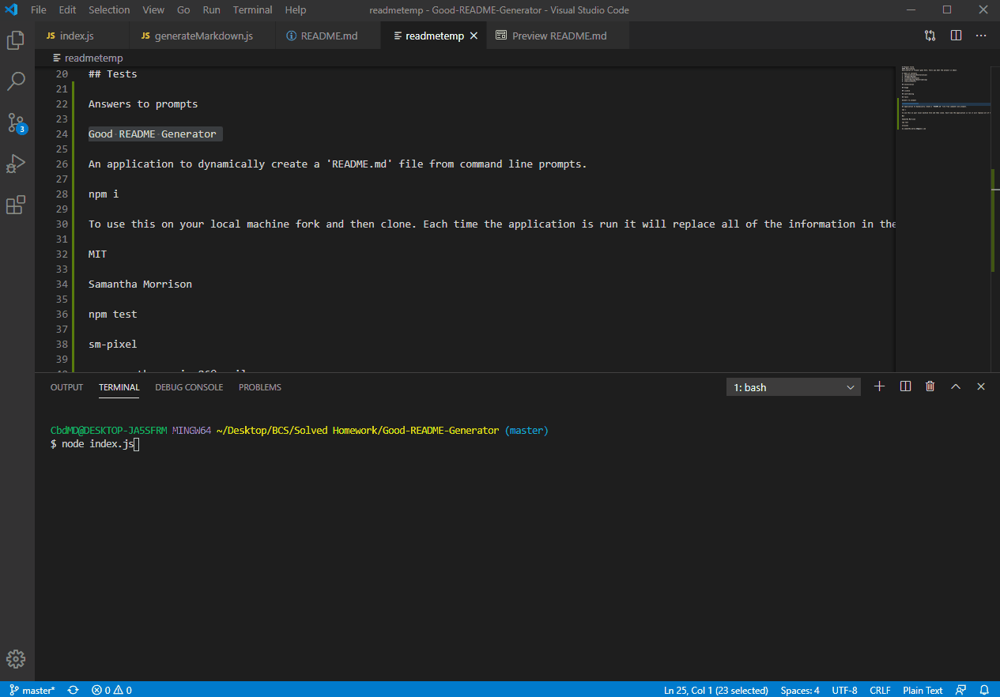

# Good README Generator

# Description 
An application to dynamically create a 'README.md' file from command line prompts.

# Demo


# Table of Contents

1. [Installation](#Installation)
2. [Usage](#Usage)
3. [License](#License)
4. [Contributing](#Contributing)
5. [Tests](#Tests)
6. [Questions](#Questions)

## Installation
To install run the code below in the terminal

```
npm i
```

## Usage
To use this on your local machine fork and then clone. Each time the application is run it will replace all of the information in the 'README.md' so please rename the readme to another name to keep the original information. Run the test command and the run 'node index.js' on the command line in the terminal.

## License
MIT

## Contributing
Samantha Morrison

## Tests

To install run the code below in the terminal

```
npm test
```

## Questions
Please direct questions to [sm-pixel](github.com/sm-pixel) or email [ms.samantha.marie.86@gmail.com](mailto:ms.samantha.marie.86@gmail.com)
  